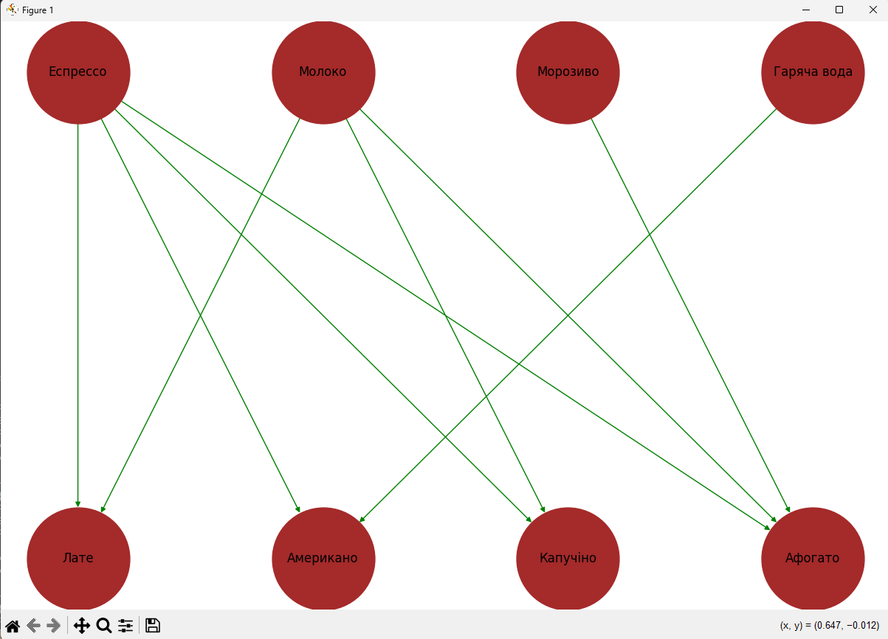

# Завдання 1

**Вершини**: ['Еспрессо', 'Молоко', 'Морозиво', 'Гаряча вода', 'Американо', 'Латe', 'Aфогато', 'Капучіно']

**Ребра**:  [('Еспрессо', 'Капучіно'), ('Еспрессо', 'Aфогато'), ('Еспрессо', 'Американо'), ('Еспрессо', 'Латe'), ('Молоко', 'Aфогато'), ('Молоко', 'Латe'), ('Молоко', 'Капучіно'), ('Морозиво', 'Aфогато'), ('Гаряча вода', 'Американо')]

**Кількісь вершин**: 8

**Кількісь ребер**: 9

**Найбільше зєднань має Eспресо**

{'Еспрессо': **0.5714285714285714**, 'Молоко': 0.42857142857142855, 'Морозиво': 0.14285714285714285, 'Гаряча вода': 0.14285714285714285, 'Американо': 0.2857142857142857, 'Латe': 0.2857142857142857, 'Aфогато': 0.42857142857142855, 'Капучіно': 0.2857142857142857}

# Завдання 2

**1. Ребра DFS-дерева з коренем у вузлі Еспрессо**

**Алгоритм DFS фокусується на вивченні одного шляху до кінця, перш ніж перейти до іншого**

**Алгоритм DFS починають з початкової вершини, відвідують її, а потім переходять до її сусідніх вершин.**

('Еспрессо', 'Капучіно'), ('Еспрессо', 'Американо'), ('Капучіно', 'Молоко'), ('Молоко', 'Aфогато'), ('Молоко', 'Латe'), ('Aфогато', 'Морозиво'), ('Американо', 'Гаряча вода')

**2. Ребра BFS-дерева з коренем у вузлі Еспрессо**

**Алгоритм BFS (ширина) починається з вибраної вершини та відвідує всі її сусідні вершини, перш ніж перейти до сусідів цих сусідів.**

('Еспрессо', 'Капучіно'), ('Еспрессо', 'Aфогато'), ('Еспрессо', 'Американо'), ('Еспрессо', 'Латe'), ('Капучіно', 'Молоко'), ('Aфогато', 'Морозиво'), ('Американо', 'Гаряча вода')

# Завдання 3
**Найкоротші шляхи від вузла 'Еспресо' до всіх інших вузлів**

'Еспресо': ['Еспресо'], 'Капучіно': ['Еспресо', 'Капучіно'], 'Aфогато': ['Еспресо', 'Aфогато'], 'Американо': ['Еспресо', 'Американо'], 'Латe': ['Еспресо', 'Латe'], 'Молоко': ['Еспресо', 'Капучіно', 'Молоко'], 'Морозиво': ['Еспресо', 'Aфогато', 'Морозиво'], 'Гаряча вода': ['Еспресо', 'Американо', 'Гаряча вода']

**Довжини найкоротших шляхів від вузла 'Еспресо' до всіх інших вузлів**

'Еспресо': 0, 'Капучіно': 1, 'Aфогато': 1, 'Американо': 1, 'Латe': 1, 'Молоко': 2, 'Морозиво': 2, 'Гаряча вода': 2
